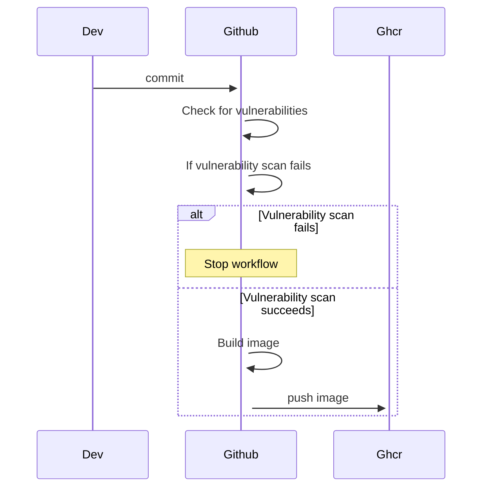
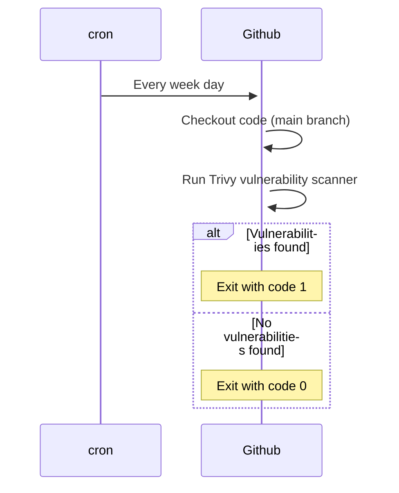

# Sample go app
This is a sample go app that create a basic server along with prometheus metrics.

### CI/CD
Here is a diagram of the CI/CD pipeline

### Trivy
We run a daily check for vulnerabilities using trivy.
