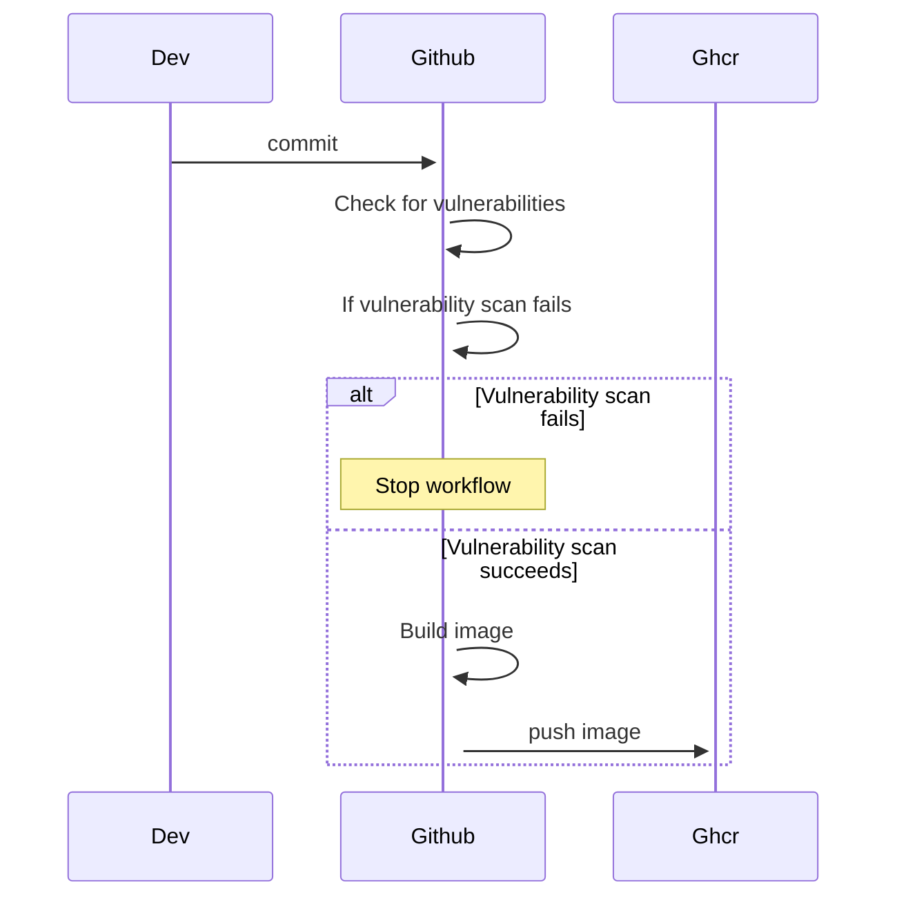
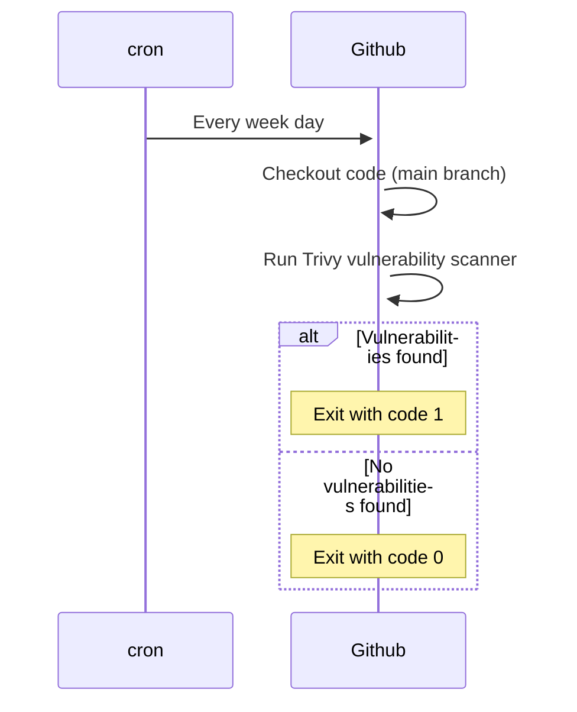

# Sample go app
This is a sample go app that create a basic server along with prometheus metrics.

## CI/CD
Here is a diagram of the CI/CD pipeline



## Trivy
We run a daily check for vulnerabilities using trivy.


## Additional configuration
### Docker
In order to use the advanced grafana dashboard filtering regarding the logs, you will need to add the following configuration to the docker daemon.

Edit the docker daemon (`/etc/docker/daemon.json`) to include the following:
(If the file does not exist, create it)
```json
{
  "log-opts": {
    "tag": "{{.ImageName}}|{{.Name}}|{{.ImageFullID}}|{{.FullID}}"
  }
}
```
Then restart the docker daemon:
```bash
sudo systemctl restart docker
```
